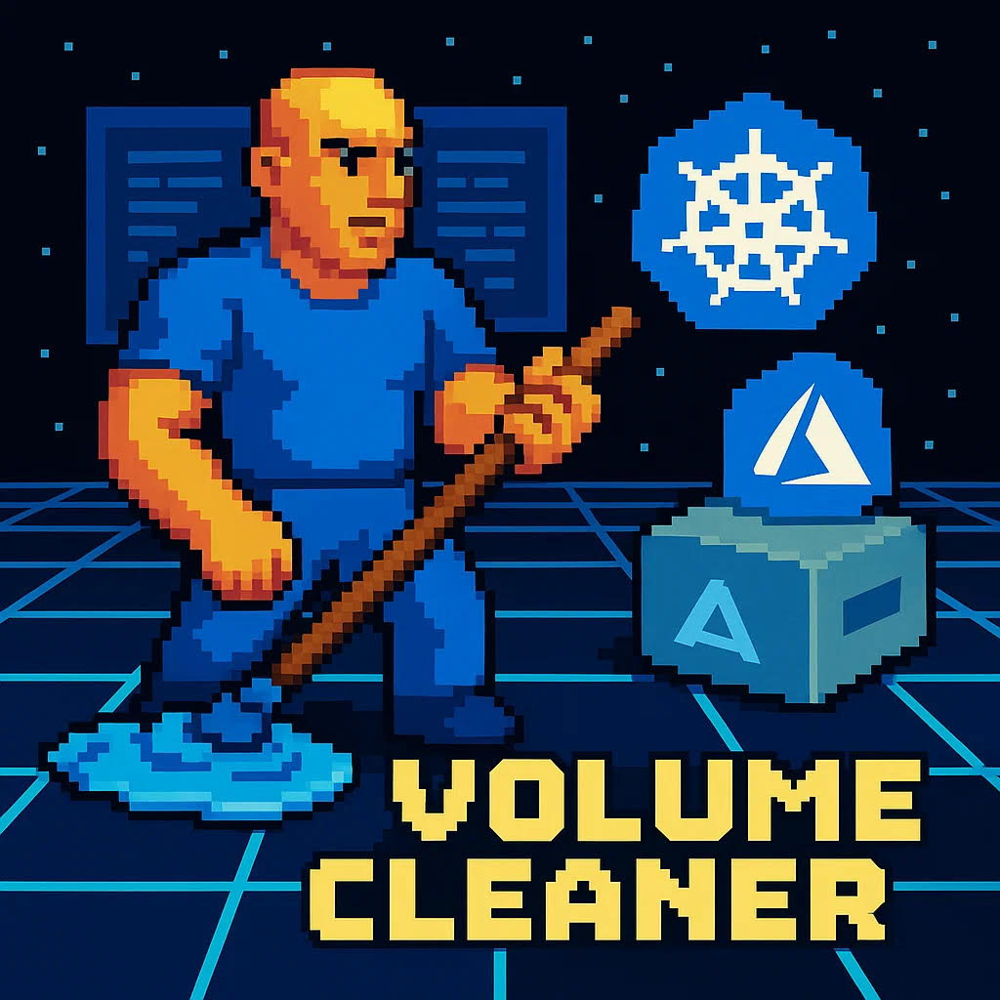

# Kubernetes Volume Cleaner

([Français](#volume-cleaner-kubernetes))

<p align="center">
    
</p>

<p align="center">
  <a href="https://deepwiki.com/StatCan/volume-cleaner">
    
  </a>
  <a href="https://www.gnu.org/licenses/agpl-3.0">
    
  </a>
</p>

A Kubernetes CronJob that automatically identifies and cleans up unused Persistent Volume Claims and Persistent Volumes (K8S).

## Contents

- [Introduction](#introduction)
- [Requirements](#requirements)
- [Features](#features)
- [Quick Start](#quick-start)
- [How to Contribute](#how-to-contribute)
- [Code of Conduct](#code-of-conduct)
- [License](#license)


## Introduction 

This project was designed to integrate with Statistic Canada’s [The Zone](https://zone.pages.cloud.statcan.ca/docs/en/) platform. In The Zone, users can create individual workspaces with Kubeflow Notebooks. To persist their work, users can attach volumes to their notebooks. These volumes are not automatically deleted when a notebook is deleted. Users are free to move them or to reuse them. As a result, over time, users tend to amass several unused volumes. These volumes sit on the cloud and result in unnecessary costs. The purpose of this project is to design an automatic system that detects these unused volumes and safely removes them, reducing unnecessary expenditure. 

Despite being primarily designed for Statistics Canada, this project strongly values open-source practices. The codebase is available for public use and the entire development process is documented on the [issues](https://github.com/StatCan/volume-cleaner/issues) page. The volume cleaner was designed to have as little coupling as possible so it can easily integrate into projects outside Statistics Canada. Using open-source and being open-source was an important development philosophy.

### Architectural Structure

**DevOps Build Process**


**In-Cluster Running Process**


## Requirements

- Golang 1.24.3 

- Kubernetes (Kubernetes API v0.33.1)

- Azure Container Registry (or some other container registry)

- GC Notify Email Service (Email Template ID + API Key) (or some other 3rd party email service)

- The Testify Testing Framework 

## Features 

- **🔍 Automatic PVC Discovery** : Scans Kubeflow namespaces to identify unattached Persistent Volume Claims that are no longer associated with StatefulSets

- **⏰ Real-time Monitoring** : Continuously watches StatefulSet lifecycle events to automatically label/unlabel PVCs when they become attached or detached

- **🏷️ Intelligent Labeling System** : Automatically applies timestamped labels to unattached PVCs for tracking staleness and cleanup eligibility

- **📧 Email Notifications** : Sends automated warning emails to namespace owners at configurable intervals before PVC deletion

- **⚡ Configurable Grace Periods** : Supports customizable grace periods (minimum 1 day) before stale PVCs are eligible for deletion

- **📅 Flexible Notification Scheduling** : Allows configuration of multiple notification times (e.g., 1, 2, 3, 7, 30 days before deletion)

- **🔄 Dual-Component Architecture** : Separates continuous monitoring (controller) from periodic cleanup operations (scheduler) for optimal resource usage

- **🧪 Comprehensive Testing** : Features extensive unit tests for all core functionality including PVC discovery, labeling, and cleanup logic

The system operates through two main components: a controller that runs continuously to monitor StatefulSet events and label PVCs, and a scheduler that runs periodically (via CronJob) to perform cleanup operations and send notifications. The project integrates with GC Notify for email services and supports Azure disk cleanup in Kubernetes environments.

## Quick Start

### Prerequisites

Set your Kubernetes context to the target cluster:

```bash

kubectl config use-context <your-cluster-context>

```

### Architecture Overview

The volume-cleaner is split into 2 main components:

- **Controller:** Continuously monitors StatefulSet events and labels unattached PVCs with timestamps
- **Scheduler:** Runs periodically to find PVCs past their stale date, sends email notifications, and deletes expired volumes

### Installation

1. Clone this repository:

```bash

git clone https://github.com/StatCan/volume-cleaner.git  
cd volume-cleaner

```

2. Customize the behavior of the Controller in `manifests/controller/controller_config.yaml`

   * `NAMESPACE`: Target namespace to monitor (e.g., "kubeflow-profile"). Leave this value as an empty string to scan all namespaces
   * `TIME_LABEL`: Label key for storing unattached timestamp (e.g.: "volume-cleaner/unattached-time") 
   * `NOTIF_LABEL`: Label key for notification count tracking (e.g.: "volume-cleaner/notification-count")
   * `TIME_FORMAT`: Timestamp format for labels (e.g: "2006-01-02_15-04-05Z")
   * `STORAGE_CLASSES`: Comma-separated list of target storage classes to filter by (e.g., "standard")
   * `RESET_RUN`: Set to "true" to remove all volume cleaner related labels from cluster before starting

3. Customize the behavior of the Scheduler in `manifests/scheduler/scheduler_config.yaml` 

   * `NAMESPACE`: Target namespace to scan for unused PVCs, leave this value as an empty string to scan all namespaces 
   * `TIME_LABEL`: Must match controller's time label
   * `NOTIF_LABEL`: Must match controller's notification label
   * `IGNORE_LABEL`: If this label is found on a PVC, the scheduler will skip it (e.g.: "volume-cleaner/ignore")
   * `GRACE_PERIOD`: Days before PVC deletion (e.g., "180") 
   * `TIME_FORMAT`: Must match controller's time format
   * `DRY_RUN`: Set to "true" for testing without actual deletion 
   * `NOTIF_TIMES`: Comma-separated days before deletion to send notifications (e.g., "1, 2, 3, 4, 7, 30")
   * `BASE_URL`: GC Notify API base URL 
   * `ENDPOINT`: Email notification endpoint 

4. Set Secrets in `manifests/scheduler/scheduler_secret.yaml` 

   * `EMAIL_TEMPLATE_ID`: GC notify email template ID 
   * `API_KEY`: GC Notify API authentication key, do not push API keys to this repository
  
5. If you're building the image yourself, configure the pull target in `manifests/controller/controller_deployment.yaml` and `manifests/scheduler/scheduler_job.yaml`. 
   E.g `image: docker.io/statcan/volume-cleaner-controller:latest`

6. Run the controller & scheduler using the Make command

```bash
make run_controller
make run_scheduler
```

7. Remove the scheduler and controller (optional)

```bash
make clean 
```
8. Trigger scheduler run immediately (optional)
```bash
kubectl create job volume-cleaner-scheduler --from=cronjob/volume-cleaner-scheduler -n ${JOB_NAMESPACE_HERE}
```
Read [this](https://github.com/StatCan/volume-cleaner/blob/main/docs/project_outline.docx) document for more information.

## How to Contribute

See [CONTRIBUTING.md](CONTRIBUTING.md)

## Code of Conduct

See [CODE_OF_CONDUCT.md](CODE_OF_CONDUCT.md)

## License

Volume Cleaner is distributed under [AGPL-3.0.only](LICENSE.md).

### Open Source at Government of Canada

- [Using Open Source Software](https://www.canada.ca/en/government/system/digital-government/digital-government-innovations/open-source-software/guide-for-using-open-source-software.html)

- [Publishing Open Source Code](https://www.canada.ca/en/government/system/digital-government/digital-government-innovations/open-source-software/guide-for-publishing-open-source-code.html)

- [Contributing to Open Source Software](https://www.canada.ca/en/government/system/digital-government/digital-government-innovations/open-source-software/guide-for-contributing-to-open-source-software.html)

______________________

# Volume Cleaner Kubernetes

<p align="center">
    
</p>

<p align="center">
  <a href="https://deepwiki.com/StatCan/volume-cleaner">
    
  </a>
  <a href="https://www.gnu.org/licenses/agpl-3.0">
    
  </a>
</p>

Un CronJob Kubernetes qui identifie automatiquement et nettoie les Persistent Volume Claims et Persistent Volumes (K8S).

## Contenu

- [Introduction](#introduction)
- [Prérequis](#prérequis)
- [Fonctionnalités](#fonctionnalités)
- [Démarrage rapide](#démarrage-rapide)
- [Comment contribuer](#comment-contribuer)
- [Code de conduite](#code-de-conduite)
- [Licence](#licence)

## Introduction

Ce projet a été conçu pour s'intégrer à la plateforme [The Zone](https://zone.pages.cloud.statcan.ca/docs/en/) de Statistique Canada. Dans The Zone, les utilisateurs peuvent créer des espaces de travail individuels avec des notebooks Kubeflow. Pour conserver leur travail, ils peuvent associer des volumes à leurs notebooks. Ces volumes ne sont pas supprimés automatiquement lors de la suppression d'un notebook. Les utilisateurs peuvent les déplacer ou les réutiliser. En conséquence, au fil du temps, de nombreux volumes inutilisés s'accumulent, entraînant des coûts cloud superflus. L'objectif de ce projet est de mettre en place un système automatique qui détecte ces volumes inutilisés et les supprime en toute sécurité, réduisant ainsi les dépenses inutiles.

Bien qu'il soit principalement conçu pour Statistique Canada, ce projet valorise fortement les pratiques de sources ouvertes. Le code est disponible publiquement et tout le processus de développement est documenté sur la page des [issues](https://github.com/StatCan/volume-cleaner/issues). Le nettoyeur de volumes a été conçu pour avoir un couplage minimal afin de pouvoir s'intégrer facilement dans d'autres projets. L'utilisation et la contribution en sources ouvertes ont été des principes directeurs importants.

### Structure architecturale

**Processus de build DevOps**


**Processus en cours d’exécution dans le cluster**


## Prérequis

- Golang 1.24.3

- Kubernetes (API Kubernetes v0.33.1)

- Azure Container Registry (ou autre registry de conteneurs)

- Service d'envoi d'e-mails GC Notify (Email Template ID + API Key) (ou autre service tiers)

- Testify's Testing Framework 

## Fonctionnalités

- **🔍 Découverte automatique de PVC** : Scanne les espaces de noms Kubeflow pour identifier les Persistent Volume Claims non attachés n'étant plus associés à des StatefulSets.

- **⏰ Surveillance en temps réel** : Observe continuellement les événements de cycle de vie des StatefulSets pour étiqueter ou retirer l'étiquette des PVC lorsqu'ils sont attachés ou détachés.

- **🏷️ Système d'étiquetage intelligent** : Applique automatiquement des étiquettes horodatées aux PVC non attachés pour suivre leur ancienneté et leur éligibilité au nettoyage.

- **📧 Notifications par e-mail** : Envoie des e-mails d'avertissement automatisés aux propriétaires de namespace à des intervalles configurables avant la suppression des PVC.

- **⚡ Délais de grâce configurables** : Prend en charge des délais de grâce personnalisables (minimum 1 jour) avant que les PVC obsolètes ne soient éligibles à la suppression.

- **📅 Planification souple des notifications** : Permet de configurer plusieurs délais de notification (par exemple, 1, 2, 3, 7, 30 jours avant la suppression).

- **🔄 Architecture à deux composants** : Sépare la surveillance continue (contrôleur) des opérations de nettoyage périodiques (planificateur) pour une utilisation optimale des ressources.

- **🧪 Tests complets** : Inclut de nombreux tests unitaires pour toutes les fonctionnalités principales, notamment la découverte, l'étiquetage et la logique de nettoyage des PVC.

Le système fonctionne via deux composants principaux : un contrôleur qui s'exécute en continu pour surveiller les événements des StatefulSets et étiqueter les PVC, et un planificateur qui s'exécute périodiquement (via CronJob) pour effectuer les opérations de nettoyage et envoyer les notifications. Le projet s'intègre à GC Notify pour le service d'e-mails et prend en charge le nettoyage des disques Azure dans les environnements Kubernetes.

## Démarrage rapide

### Prérequis

Placez votre contexte Kubernetes sur le cluster cible :

```bash
kubectl config use-context <votre-cluster-context>
````

### Vue d’ensemble de l’architecture

Le volume-cleaner est composé de 2 composants principaux :

* **Contrôleur :** Surveille en continu les événements de StatefulSet et étiquette les PVC non attachés avec un horodatage
* **Planificateur :** S’exécute périodiquement pour repérer les PVC dépassant leur date de péremption, envoyer des notifications par e‑mail et supprimer les volumes expirés

### Installation

1. Clonez ce dépôt :

   ```bash
   git clone https://github.com/StatCan/volume-cleaner.git  
   cd volume-cleaner
   ```

2. Personnalisez le comportement du Contrôleur dans `manifests/controller/controller_config.yaml` :

   * `NAMESPACE` : Espace de noms à surveiller (par ex. “kubeflow-profile”); laissez cette valeur vide pour scanner tous les espaces de noms
   * `TIME_LABEL` : Clé de l'étiquette pour stocker l’horodatage des PVC non attachés (par ex. `volume-cleaner/unattached-time`)
   * `NOTIF_LABEL` : Clé de l'étiquette pour le suivi du nombre de notifications (par ex. `volume-cleaner/notification-count`)
   * `TIME_FORMAT` : Format de l’horodatage pour les étiquettes (par défaut : `2006-01-02_15-04-05Z`)
   * `STORAGE_CLASSES` : Liste des classes de stockage cibles à filtrer, séparée par des virgules (p. ex. "standard")
   * `RESET_RUN` : Définir sur 'true' pour retirer tous les étiquettes liés au nettoyeur de volumes du cluster avant le démarrage.

3. Personnalisez le comportement du Planificateur dans `manifests/scheduler/scheduler_config.yaml` :

   * `NAMESPACE` : Espace de noms à scanner pour les PVC périmés; laissez cette valeur vide pour scanner tous les espaces de noms
   * `TIME_LABEL` : Doit correspondre au `TIME_LABEL` du contrôleur
   * `NOTIF_LABEL` : Doit correspondre au `NOTIF_LABEL` du contrôleur
   * `IGNORE_LABEL` : Si cette étiquette est présente sur un PVC, le planificateur l’ignorera (par exemple : `volume-cleaner/ignore`).
   * `GRACE_PERIOD` : Nombre de jours avant suppression du PVC (par ex. `"180"`)
   * `TIME_FORMAT` : Doit correspondre au `TIME_FORMAT` du contrôleur
   * `DRY_RUN` : À `"true"` pour tester sans suppression réelle
   * `NOTIF_TIMES` : Jours avant suppression pour envoyer des notifications (par ex. `"1,2,3,4,7,30"`)
   * `BASE_URL` : URL de base de l’API GC Notify
   * `ENDPOINT` : Point de terminaison pour l’envoi des e‑mails

4. Définissez les Secrets dans `manifests/scheduler/scheduler_secret.yaml` :

   * `EMAIL_TEMPLATE_ID` : ID du modèle d’e‑mail GC Notify
   * `API_KEY` : Clé d’authentification GC Notify, ne pas pousser les clés API dans ce dépôt

5. Si vous construisez l'image vous-même, configurez la cible d'extraction dans `manifests/controller/controller_deployment.yaml` et `manifests/scheduler/scheduler_job.yaml`.
Ex. `image: docker.io/statcan/volume-cleaner-controller:latest`.

6. Lancez le Contrôleur et le Planificateur avec Make :

   ```bash
   make run_controller
   make run_scheduler
   ```

7. Supprimez le planificateur et le contrôleur (optionnel) :

   ```bash
   make clean
   ```
8. Déclencher immédiatement l'exécution du planificateur (optionnel)
```bash
kubectl create job volume-cleaner-scheduler --from=cronjob/volume-cleaner-scheduler -n ${NOM_ESPACE_DE_NOMS_ICI}
```
Lisez [ce](https://github.com/StatCan/volume-cleaner/blob/main/docs/project_outline.docx) document pour plus d'informations (version en anglais seulement).

## Comment contribuer

Consultez [CONTRIBUTING.md](CONTRIBUTING.md)

## Code de conduite

Consultez [CODE_OF_CONDUCT.md](CODE_OF_CONDUCT.md)

## Licence

Volume Cleaner est distribué sous [AGPL-3.0.only](LICENSE.md).

### Open Source au sein du Gouvernement du Canada

- [Utilisation de logiciels Open Source](https://www.canada.ca/fr/gouvernement/systeme/gouvernement-numerique/innovations-gouvernementales-numeriques/logiciels-libres/guide-pour-lutilisation-de-logiciels-libres.html)
- [Publication de code Open Source](https://www.canada.ca/fr/gouvernement/systeme/gouvernement-numerique/innovations-gouvernementales-numeriques/logiciels-libres/guide-pour-la-publication-du-code-source-libre.html)
- [Contribution aux logiciels Open Source](https://www.canada.ca/fr/gouvernement/systeme/gouvernement-numerique/innovations-gouvernementales-numeriques/logiciels-libres/guide-de-contribution-aux-logiciels-libres.html)
