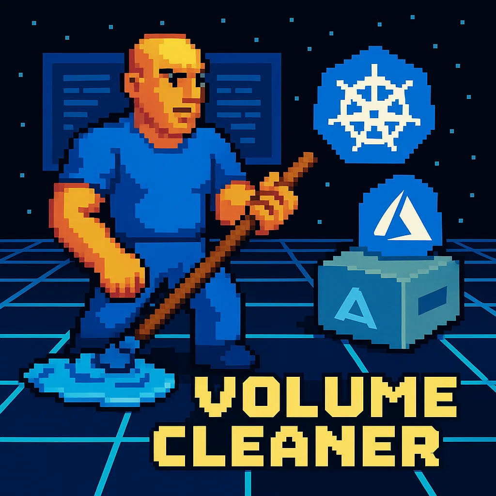

# Kubernetes Volume Cleaner

([Français](#volume-cleaner-kubernetes))

    

  
  

A Kubernetes CronJob that automatically identifies and cleans up stale Persistent Volume Claims and Persistent Volumes (K8S) linked to an associated Azure disk.

## Contents

- [Introduction](#introduction)
- [Requirements](#requirements)
- [Features](#features)
- [Quick Start](#quick-start)
- [How to Contribute](#how-to-contribute)
- [Code of Conduct](#code-of-conduct)
- [License](#license)

## Introduction 

This project was designed to integrate with Statistic Canada’s [The Zone](https://zone.pages.cloud.statcan.ca/docs/en/) platform. In The Zone, users can create individual workspaces with Kubeflow Notebooks. To persist their work, users can attach volumes to their notebooks. These volumes are not automatically deleted when a notebook is deleted. Users are free to move them or to reuse them. As a result, over time, users tend to amass several unused volumes. These volumes sit on the cloud and result in unnecessary costs. The purpose of this project is to design an automatic system that detects these unused volumes and safely removes them, reducing unnecessary expenditure. 

Despite being primarily designed for Statistics Canada, this project strongly values open-source practices. The codebase is available for public use on the [Github repository](https://github.com/StatCan/volume-cleaner), and the entire development process is documented on the [issues](https://github.com/StatCan/volume-cleaner/issues) page. The volume cleaner was designed to have as little coupling as possible so it can easily integrate into projects outside Statistics Canada. Using open-source and being open-source was an important development philosophy.

### Architectural Structure

## Requirements

- Golang 1.24.3 

- Kubernetes (Kubernetes API v0.33.1)

- Azure Container Registry (or some other container registry)

- GC Notify Email Service (Email Template ID + API Key) (or some other 3rd party email service)

- Testify's Testing Framework 

## Features 

- **Automatic PVC Discovery** : Scans Kubeflow namespaces to identify unattached Persistent Volume Claims that are no longer associated with StatefulSets

- **Real-time Monitoring** : Continuously watches StatefulSet lifecycle events to automatically label/unlabel PVCs when they become attached or detached

- **Intelligent Labeling System** : Automatically applies timestamped labels to unattached PVCs for tracking staleness and cleanup eligibility

- **Email Notifications** : Sends automated warning emails to namespace owners at configurable intervals before PVC deletion

- **Configurable Grace Periods** : Supports customizable grace periods (minimum 1 day) before stale PVCs are eligible for deletion

- **Flexible Notification Scheduling** : Allows configuration of multiple notification times (e.g., 1, 2, 3, 7, 30 days before deletion)

- **Dual-Component Architecture** : Separates continuous monitoring (controller) from periodic cleanup operations (scheduler) for optimal resource usage

- **Comprehensive Testing** : Features extensive unit tests for all core functionality including PVC discovery, labeling, and cleanup logic

The system operates through two main components: a controller that runs continuously to monitor StatefulSet events and label PVCs, and a scheduler that runs periodically (via CronJob) to perform cleanup operations and send notifications. The project integrates with GC Notify for email services and supports Azure disk cleanup in Kubernetes environments.

## Quick Start

## How to Contribute

See [CONTRIBUTING.md](CONTRIBUTING.md)

## Code of Conduct

See [CODE_OF_CONDUCT.md](CODE_OF_CONDUCT.md)

## License

Volume Cleaner is distributed under [AGPL-3.0.only](LICENSE.md).

### Open Source at Government of Canada

- [Using Open Source Software](https://www.canada.ca/en/government/system/digital-government/digital-government-innovations/open-source-software/guide-for-using-open-source-software.html)

- [Publishing Open Source Code](https://www.canada.ca/en/government/system/digital-government/digital-government-innovations/open-source-software/guide-for-publishing-open-source-code.html)

- [Contributing to Open Source Software](https://www.canada.ca/en/government/system/digital-government/digital-government-innovations/open-source-software/guide-for-contributing-to-open-source-software.html)

______________________

# Volume Cleaner Kubernetes

    

  
  

Un CronJob Kubernetes qui identifie automatiquement et nettoie les Persistent Volume Claims et Persistent Volumes (K8S) obsolètes liés à un disque Azure associé.

## Contenu

- [Introduction](#introduction)
- [Prérequis](#prérequis)
- [Fonctionnalités](#fonctionnalités)
- [Démarrage rapide](#démarrage-rapide)
- [Comment contribuer](#comment-contribuer)
- [Code de conduite](#code-de-conduite)
- [Licence](#licence)

## Introduction

Ce projet a été conçu pour s'intégrer à la plateforme [The Zone](https://zone.pages.cloud.statcan.ca/docs/en/) de Statistique Canada. Dans The Zone, les utilisateurs peuvent créer des espaces de travail individuels avec des notebooks Kubeflow. Pour conserver leur travail, ils peuvent associer des volumes à leurs notebooks. Ces volumes ne sont pas supprimés automatiquement lors de la suppression d'un notebook. Les utilisateurs peuvent les déplacer ou les réutiliser. En conséquence, au fil du temps, de nombreux volumes inutilisés s'accumulent, entraînant des coûts cloud superflus. L'objectif de ce projet est de mettre en place un système automatique qui détecte ces volumes inutilisés et les supprime en toute sécurité, réduisant ainsi les dépenses inutiles.

Bien qu'il soit principalement conçu pour Statistique Canada, ce projet valorise fortement les pratiques open source. Le code est disponible publiquement sur le [dépôt GitHub](https://github.com/StatCan/volume-cleaner), et tout le processus de développement est documenté sur la page des [issues](https://github.com/StatCan/volume-cleaner/issues). Le nettoyeur de volumes a été conçu pour avoir un couplage minimal afin de pouvoir s'intégrer facilement dans d'autres projets. L'utilisation et la contribution en open source ont été des principes directeurs importants.

### Structure architecturale

## Prérequis

- Golang 1.24.3

- Kubernetes (API Kubernetes v0.33.1)

- Azure Container Registry (ou autre registry de conteneurs)

- Service d'envoi d'e-mails GC Notify (Email Template ID + API Key) (ou autre service tiers)

- Testify's Testing Framework 

## Fonctionnalités

- **Découverte automatique de PVC** : Scanne les namespaces Kubeflow pour identifier les Persistent Volume Claims non attachés n'étant plus associés à des StatefulSets.

- **Surveillance en temps réel** : Observe continuellement les événements de cycle de vie des StatefulSets pour étiqueter ou retirer l'étiquette des PVC lorsqu'ils sont attachés ou détachés.

- **Système d'étiquetage intelligent** : Applique automatiquement des étiquettes horodatées aux PVC non attachés pour suivre leur ancienneté et leur éligibilité au nettoyage.

- **Notifications par e-mail** : Envoie des e-mails d'avertissement automatisés aux propriétaires de namespace à des intervalles configurables avant la suppression des PVC.

- **Délais de grâce configurables** : Prend en charge des délais de grâce personnalisables (minimum 1 jour) avant que les PVC obsolètes ne soient éligibles à la suppression.

- **Planification souple des notifications** : Permet de configurer plusieurs délais de notification (par exemple, 1, 2, 3, 7, 30 jours avant la suppression).

- **Architecture à deux composants** : Sépare la surveillance continue (contrôleur) des opérations de nettoyage périodiques (planificateur) pour une utilisation optimale des ressources.

- **Tests complets** : Inclut de nombreux tests unitaires pour toutes les fonctionnalités principales, notamment la découverte, l'étiquetage et la logique de nettoyage des PVC.

Le système fonctionne via deux composants principaux : un contrôleur qui s'exécute en continu pour surveiller les événements des StatefulSets et étiqueter les PVC, et un planificateur qui s'exécute périodiquement (via CronJob) pour effectuer les opérations de nettoyage et envoyer les notifications. Le projet s'intègre à GC Notify pour le service d'e-mails et prend en charge le nettoyage des disques Azure dans les environnements Kubernetes.

## Démarrage rapide

## Comment contribuer

Consultez [CONTRIBUTING.md](CONTRIBUTING.md)

## Code de conduite

Consultez [CODE_OF_CONDUCT.md](CODE_OF_CONDUCT.md)

## Licence

Volume Cleaner est distribué sous [AGPL-3.0.only](LICENSE.md).

### Open Source au sein du Gouvernement du Canada

- [Utilisation de logiciels Open Source](https://www.canada.ca/fr/gouvernement/systeme/gouvernement-numerique/innovations-gouvernementales-numeriques/logiciels-libres/guide-pour-lutilisation-de-logiciels-libres.html)
- [Publication de code Open Source](https://www.canada.ca/fr/gouvernement/systeme/gouvernement-numerique/innovations-gouvernementales-numeriques/logiciels-libres/guide-pour-la-publication-du-code-source-libre.html)
- [Contribution aux logiciels Open Source](https://www.canada.ca/fr/gouvernement/systeme/gouvernement-numerique/innovations-gouvernementales-numeriques/logiciels-libres/guide-de-contribution-aux-logiciels-libres.html)
